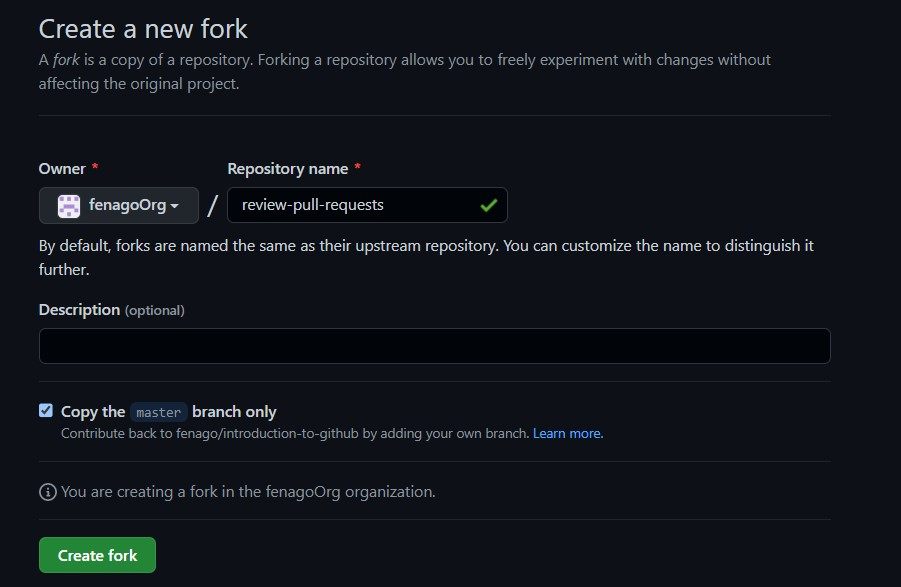

# Review pull requests

All great projects start with collaboration. Pull requests are the foundation of teamwork on GitHub — and pull request reviews give you the ability to work together and discuss changes specific to a pull request by commenting, requesting changes, or approving.

- **Who is this for**: Developers, new GitHub users, users new to Git, students, managers, teams.
- **What you'll learn**: When and how to request a review; how to provide a review of someone else's pull request.
- **What you'll build**: We'll be reviewing a pull request for a simple game.
- **How long**: This course is five steps long and takes less than 30 minutes to complete.

## How to start this course

1. Open following URL in browser, click **Fork** and open the link in a new tab.
   `https://github.com/fenago/review-pull-requests`

   
2. In the new tab, follow the prompts to create a new repository.
   - For owner, choose your personal account or an organization to host the repository.
   - We recommend creating a public repository—private repositories will [use Actions minutes].
   
3. After your new repository is created, wait about 20 seconds, then refresh the page. Follow the step-by-step instructions in the new repository's README.

<h2>Step 1: Assign yourself as a reviewer</h2>

_Welcome to "Review pull requests"! :wave:_

**What is a _pull request review_?**: Reviewing a pull request is an opportunity to examine another contributor's changes and give them feedback. It's an awesome opportunity to learn more about how the project works and how others solve problems.

The best way to get a review is to ask for one. On GitHub, you can ask someone to review a pull request by assigning them as a reviewer. If you are not ready for review, consider [creating a draft pull request] instead.

### Activity: Assign yourself as a reviewer

1. Open a new browser tab, and work on the steps in your second tab while you read the instructions in this tab.
1. We made a pull request for you from the `update-game` branch, so open that pull request.
1. Under **Reviewers** on the right side of the screen, add yourself as a reviewer.

Next, wait about 20 seconds for actions to run, then refresh this course's README.

<h2>Step 2: Leave a review</h2>

_You assigned yourself as a reviewer! :tada:_

Pull request reviews ensure quality and maintain momentum of changes to your project.

#### When reviewing a pull request:

1. Review the _title_ and _body_ of the pull request, and possibly any associated issue, to understand the intended change. 
1. Review the [diff], the comparison of the proposed code, in the context of the whole project.
1. For most things, try out the proposed change. Check if the actual change matches the intention. Find the repository's [contributing guide] to find out how to review the changes.

#### In your review comments:

- Identify potential issues, risks, and limitations.
- Suggest changes and improvements.
- Share awareness of upcoming changes that the pull request doesn't account for.
- Ask questions to verify shared understanding.
- Highlight what the author did well and should keep doing.
- Prioritize the most important feedback.
- Be concise _and_ provide meaningful detail.
- Treat the pull request author with kindness and empathy.

When an approval or request for changes is not yet needed, consider using **comments**. An **approval** lets the author know you believe the pull request is safe to merge. **Requesting changes** lets the author know you believe the pull request is not ready to merge.

### Activity: Leave a review

1. On the pull request, click **Files changed**.
1. Click **Review changes**.
1. Add a comment with your initial thoughts on the pull request.
1. Select _comment_, _approve_, or _request changes_: any option will work.
1. Click **Submit review**.

Next, wait about 20 seconds for actions to run, then refresh this course's README.

<h2>Step 3: Suggest changes</h2>

_Nice work reviewing that pull request :sparkles:_

Now that you have explored the different ways you can review a pull request it is time to learn how to use _suggest changes_.

**What is _suggest changes_?**: This feature enables you to recommend a change to a pull request that the author can commit with the push of a button.

### Activity: Suggest changes

1. On the pull request, click **Files changed**.
1. Find the `index.html` changes.
1. Hover your cursor next to the line numbers on the left side of the page.
1. Click the blue plus icon.
1. After the comment form appears, click the **Add a suggestion** button.  

1. Edit the suggestion.
1. Click **Add a single comment**.

Next, wait about 20 seconds for actions to run, then refresh this course's README.

<h2>Step 4: Apply suggested changes</h2>

_Nicely done suggesting changes! :partying_face:_

Now let's see how easy it is to [apply your suggestion].

### Activity: Apply suggested changes

1. Click **Commit suggestion**.
1. Type a commit message.
1. Click **Commit changes**.

Next, wait about 20 seconds for actions to run, then refresh this course's README.

<h2>Step 5: Merge your pull request</h2>

_Almost there! :heart:_

You can now [merge] your pull request!

### Activity: Merge your pull request

1. Click **Merge pull request**.
1. Delete the branch `update-game` (optional).

Next, wait about 20 seconds for actions to run, then refresh this course's README.

<h2>Finish</h2>

_Congratulations friend, you've completed this course!_

As you continue working on GitHub, remember that high quality reviews improve your projects. If you are new to a repository, inquire about what review practices they have so you can hit the ground running.

Here's a recap of all the tasks you've accomplished in your repository:

- You learned how to assign pull requests for review.
- You left a review on a pull request.
- You suggested changes to a pull request.
- You applied suggested changes to a pull request.
